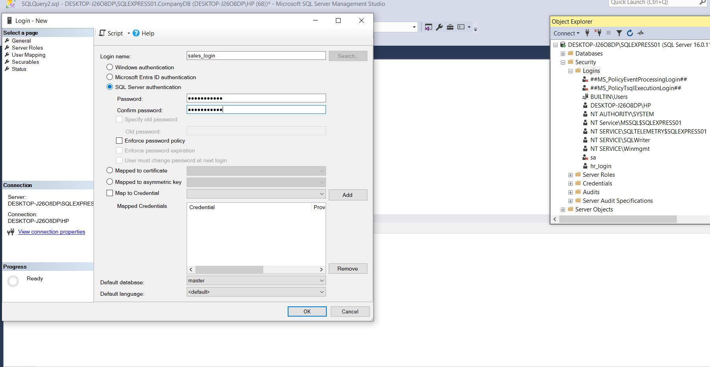
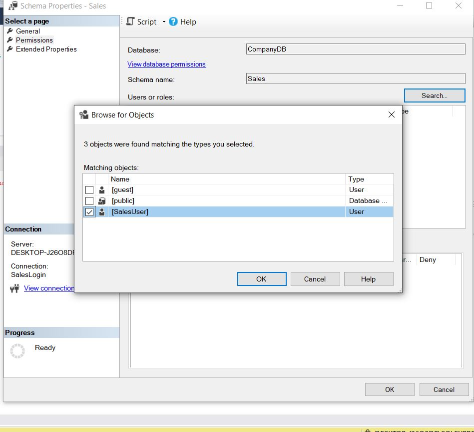
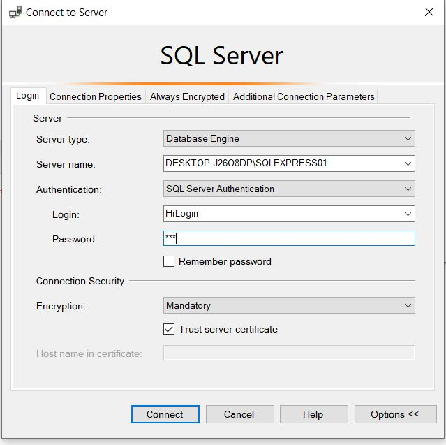
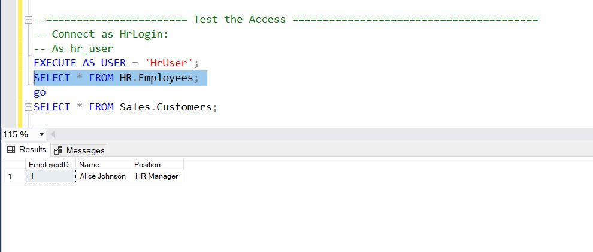
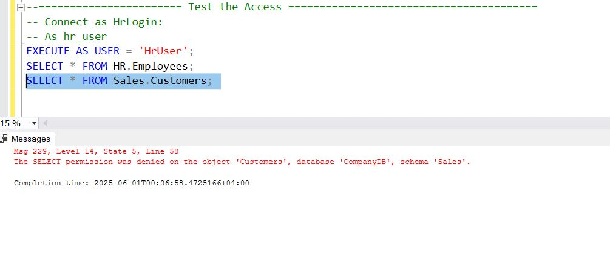
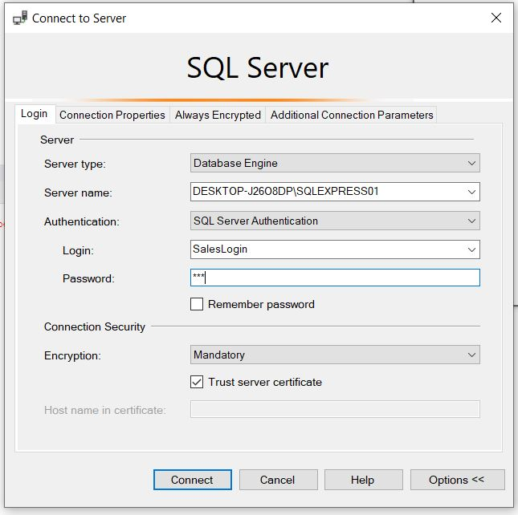

# Task: Enforcing Schema-Level Access in a Company Database 

# Security Implementation in SQL Server
*<ins>*Scenario** 

You are the database administrator of a system that contains two main departments: 

• HR (Human Resources) 

• Sales

Each department has its own schema in the database.
- Your job is to restrict access so that each department only views and works with its own data. 

- Objective 
1. Create SQL logins and map them to users inside the database. 
2. Create two schemas: HR and Sales. 
3. Create a few sample tables inside each schema. 
4. Assign schema-level permissions so: 
	- HR users cannot access Sales data. 
	- Sales users cannot access HR data.

*<ins>*Task**
**1.  Create SQL logins and map them to users inside the database.**
	
 directly in SQL Server Management Studio (SSMS):
1. Open SSMS and connect to your SQL Server instance.
2. In Object Explorer, expand the "Security" node.
3. Right-click on "Logins" and select "New Login...".
4. Enter the login name (e.g., `hr_login` for HR and `sales_login` for Sales).
5. Set the password and configure other options as needed.
6. Click "OK" to create the login.


Or by use sql script 
```
-- ==================================== HR Login and User ================================
-- Create login for HR
CREATE LOGIN HrLogin WITH PASSWORD = '123';
-- Create user in the database for HR
CREATE USER HrUser FOR LOGIN HrLogin;

-- =================================== Sales Login and User ===================================
-- Create login for Sales
CREATE LOGIN SalesLogin WITH PASSWORD = '456';
-- Create user in the database for Sales
CREATE USER SalesUser FOR LOGIN SalesLogin;
```
**2. Create two schemas: HR and Sales.**
```
-- ================================ Schema =======================================
-- Create schemas
CREATE SCHEMA HR AUTHORIZATION HrUser;
CREATE SCHEMA Sales AUTHORIZATION SalesUser;

```
**3. Create a few sample tables inside each schema.**
```
-- Inside HR Schema
CREATE TABLE HR.Employees (
    EmployeeID INT PRIMARY KEY,
    Name VARCHAR(100),
    Position VARCHAR(50)
);

INSERT INTO HR.Employees VALUES (1, 'Alice Johnson', 'HR Manager');

-- Inside Sales Schema
CREATE TABLE Sales.Customers (
    CustomerID INT PRIMARY KEY,
    CustomerName VARCHAR(100),
    Email VARCHAR(100)
);

INSERT INTO Sales.Customers VALUES (101, 'Global Corp', 'contact@global.com');

```

**4. Assign schema-level permissions so:**
```
-- Grant HR User Access to HR Schema Only
-- Allow HR user access to HR schema
GRANT SELECT, INSERT, UPDATE, DELETE ON SCHEMA::HR TO HrUser;
-- Deny access to Sales schema
DENY SELECT ON SCHEMA::Sales TO HrUser;

-- Grant Sales User Access to Sales Schema Only
-- Allow Sales user access to Sales schema
GRANT SELECT, INSERT, UPDATE, DELETE ON SCHEMA::Sales TO SalesUser;
-- Deny access to HR schema
DENY SELECT ON SCHEMA::HR TO SalesUser;

```
can be done in SQL Server Management Studio (SSMS) in security section 
by right-clicking on the schema and selecting "Properties", then navigating to the "Permissions" tab to add or deny permissions for the respective users
For Example:

**5. Test the Access Control**
To verify that the access control is working as intended, you can log in as each user and attempt to access the data.
For example, log in as `HrLogin` and try to select from the `Sales.Customers` table. You should receive an error indicating that access is denied. Similarly, logging in as `SalesLogin` and trying to access `HR.Employees` should also result in an access denied error.

** Test as HrLogin:**
first need to connect as `HrLogin` and then try to access the HR and Sales data.

```
-- Connect as HrLogin:
-- As hr_user
EXECUTE AS USER = 'HrUser';
SELECT * FROM HR.Employees;
SELECT * FROM Sales.Customers;
```
HR Access

HR Not Access


** Test as SalesLogin:**
first need to connect as `SalesLogin` and then try to access the HR and Sales data.

```
-- Connect as SalesLogin
EXECUTE AS USER = 'SalesUser';
SELECT * FROM Sales.Customers;
SELECT * FROM HR.Employees;
```
Error cuses setting of perimission which put sales user cannot select data from data by mistics


## 3. Write a short explanation: 

o Why schema-level security is better than table-by-table permissions 
Schema-level security is more efficient and manageable than table-by-table permissions for several reasons:
1. **Centralized Management**: Schema-level permissions allow you to manage access at a higher level, reducing the complexity of managing individual table permissions. This is particularly useful in large databases with many tables.
2. **Consistency**: By applying permissions at the schema level, you ensure that all tables within that schema inherit the same access rules, reducing the risk of inconsistent permissions across tables.
3. **Scalability**: As new tables are added to a schema, they automatically inherit the permissions set at the schema level, making it easier to scale the database without needing to reconfigure permissions for each new table.
4. **Data Segregation**: Schema-level security allows for clear separation of data between different departments or functional areas, which is essential in environments where data privacy and security are critical.
o How this setup supports data segregation in real-world companies 
1. Enforces department-based access control

2. Prevents cross-department data leakage

3. Supports principle of least privilege, a key security best practice